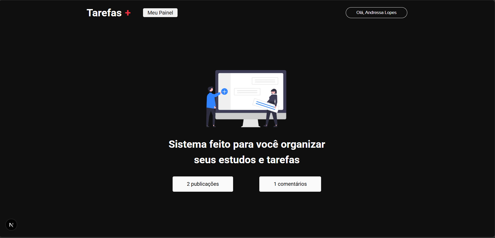
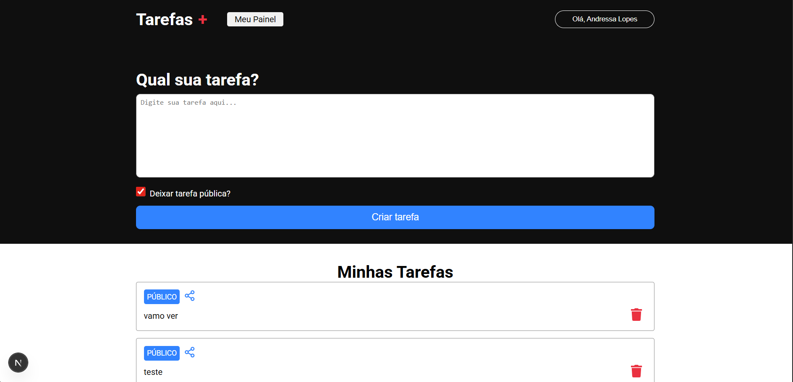
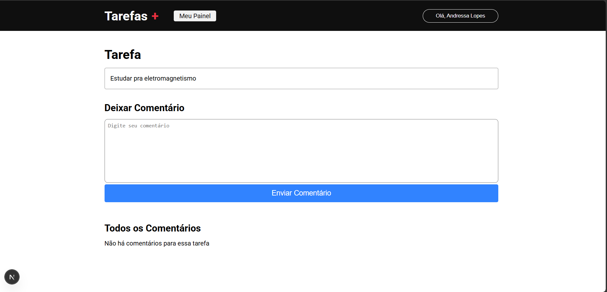

# ✅ Tarefas+

O **Tarefas+** é uma aplicação web desenvolvida com **Next.js**, utilizando **Firebase** como backend (CRUD completo) e **NextAuth** para autenticação via **Google**.  
O sistema permite criar, visualizar e gerenciar tarefas (ou posts), além de adicionar comentários vinculados a cada tarefa, com acesso por listagem geral ou por ID.

---

## 🚀 Funcionalidades

- 🔐 Autenticação com Google (NextAuth)
- 📝 CRUD completo de tarefas/posts
- 💬 Comentários associados às tarefas
- 🔍 Acesso às tarefas por ID
- 📄 Listagem geral de tarefas
- 📊 Dashboard para visualização das informações
- 🔥 Integração com Firebase (Firestore)

---

## 🛠️ Tecnologias Utilizadas

- **Framework:** Next.js (React + TypeScript)
- **Autenticação:** NextAuth.js (Google Provider)
- **Backend / Database:** Firebase (Firestore)
- **Estilização:** CSS Modules + CSS Global
- **Linguagem:** TypeScript
- **Versionamento:** Git & GitHub

---

## 📂 Estrutura do Projeto

```text
src/
├── components/
│   ├── header/
│   │   ├── index.tsx
│   │   └── styles.module.css
│   └── textarea/
│       ├── index.tsx
│       └── styles.module.css
│
├── pages/
│   ├── api/
│   │   └── auth/
│   │       └── [...nextauth].ts
│   ├── dashboard/
│   │   ├── index.tsx
│   │   └── styles.module.css
│   ├── task/
│   │   ├── [id].tsx
│   │   └── styles.module.css
│   ├── _app.tsx
│   └── index.tsx
│
├── services/
│   └── firebaseConnection.ts
│
└── styles/
    ├── globals.css
    └── home.module.css
```

---

## 🔐 Autenticação
A autenticação é feita utilizando NextAuth.js com provedor Google, garantindo login seguro e rápido.
Arquivo responsável:
```text
pages/api/auth/[...nextauth].ts
```
---

## 🔥 Firebase
O Firebase é utilizado para:
- Armazenar tarefas/posts
- Armazenar comentários vinculados às tarefas
- Realizar operações de Create, Read, Update e Delete (CRUD)

Configuração centralizada em:
```text
services/firebaseConnection.ts
```

---

## 🔄 Fluxo da Aplicação

1. Usuário realiza login com Google  
2. Acesso ao dashboard  
3. Criação de tarefas/posts  
4. Cada tarefa recebe um ID único  
5. Comentários podem ser adicionados à tarefa  
6. A tarefa pode ser acessada:
   - Pela listagem geral
   - Diretamente pelo ID (`/task/[id]`)

---

## ▶️ Como Executar o Projeto
📦 Instalar dependências
```bash
npm install
# ou
yarn install
```
▶️ Rodar o projeto
```bash
npm run dev
# ou
yarn dev
```
A aplicação estará disponível em:
```text
http://localhost:3000
```

---

## 🔑 Variáveis de Ambiente
Crie um arquivo .env.local com as seguintes variáveis:
```text
GOOGLE_CLIENT_ID=seu_client_id
GOOGLE_CLIENT_SECRET=seu_client_secret
NEXTAUTH_SECRET=sua_chave_secreta

NEXT_PUBLIC_FIREBASE_API_KEY=xxxx
NEXT_PUBLIC_FIREBASE_AUTH_DOMAIN=xxxx
NEXT_PUBLIC_FIREBASE_PROJECT_ID=xxxx
NEXT_PUBLIC_FIREBASE_STORAGE_BUCKET=xxxx
NEXT_PUBLIC_FIREBASE_MESSAGING_SENDER_ID=xxxx
NEXT_PUBLIC_FIREBASE_APP_ID=xxxx
```

---

## 🖼️ Preview

**Home**


**Dashboard**


**Página da Tarefa**


---

## 👩‍💻 Desenvolvido por

**Andressa Lopes**  
🔗 GitHub: https://github.com/AndreessaLopes
